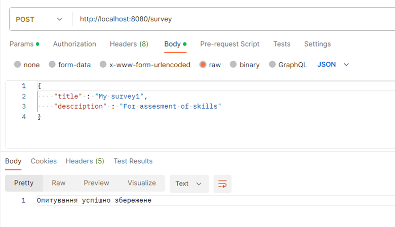
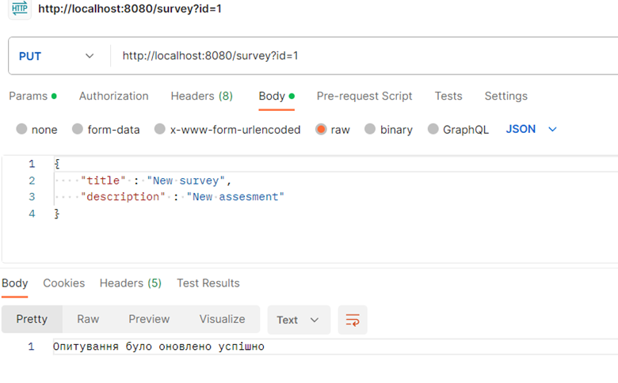
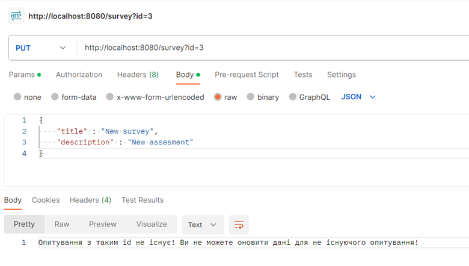
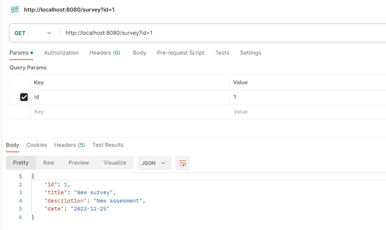
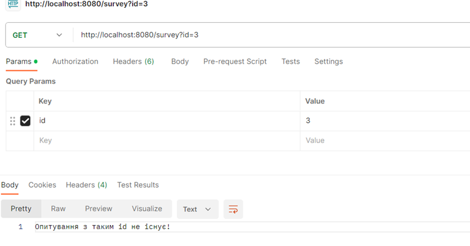
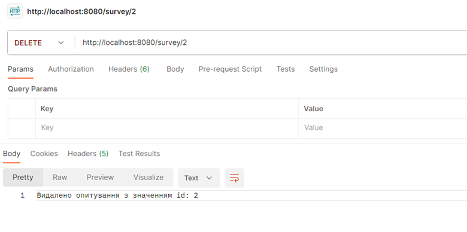
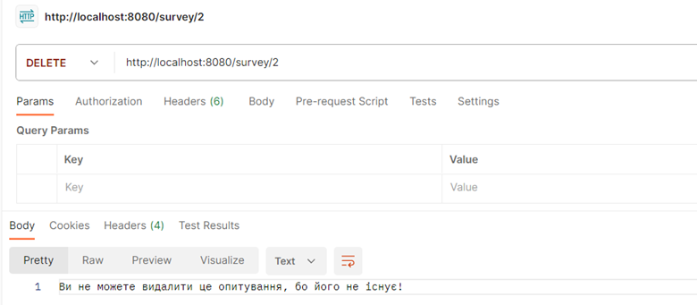
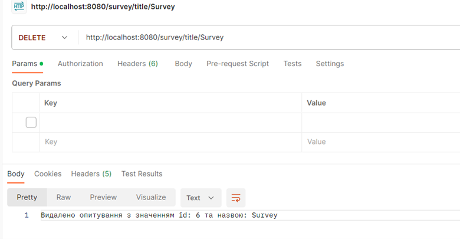

# Тестування працездатності системи

Тестування системи проводилось у IDE JetBrains IntelliJ IDEA за допомогою застосунку Postman

## Створення опитування

Успішне створення опитування

## Редагування опитування

Успішне редагування опитування

Неуспішне редагування опитування (SurveyNotExistException)

## Отримання опитування

Успішне отримання опитування

Неуспішне отримання опитування (SurveyNotExistException)

## Видалення опитування

Успішне видалення опитування за id

Неуспішне видалення опитування

Успішне видалення опитування за значенням title
